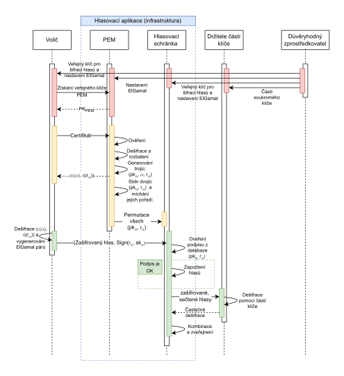

### Disclaimer: The code in this repository is not considered secure. The only purpose of this repository is to demonstrate principles of a protocol outlined in my thesis. 

# Confidential electronic shareholder meeting voting scheme
## Introduction
In this repository you'll find my master thesis project that focuses on expanding [Practical Multi-Candidate Election System (Baudron et al., 2001)](https://people.csail.mit.edu/rivest/voting/papers/BaudronFouquePointchevalPoupardStern-PracticalMultiCandidateElectionSystem.pdf).
The focus of the expanded protocol is to:
- Mask the identity without obtaining unique proof of identity for each vote, and doing so without the need for complex zero knowledge proofs.
- Extend the scheme defined in the paper to be able to cast not only votes for multiple candidates but also multiple times, simulating a shareholder meeting.

The first goal is achieved by using an El-Gamal signature scheme that allows you to generate what this protocol refers to as "Chameleon keys". Because of this property 
the voter needs to only prove his identity to a Certification Authority (CA) once with the original El-Gamal key and the eligible amount of votes being included 
in the verified certificate. This can be done simply, e.g. generating 10 distinct certificates and letting the CA randomly pick 9 out of 10 to uncover to verify with the last one
being blindly signed. 

The original El-Gamal key thus stays hidden and using a TEE we can then generate new El-Gamal key pairs from the original key. 
The public keys are then shared with the "tally server" so that it can then verify the votes being cast. The secret keys are
used to sign the votes and are only known to the voter (as long as TEE underwent proper attestation). 

The second goal is achieved by encoding the vote in base three. With individual voting choices being encoded positionally in the digits of 
the base three number. Base three is chosen so that the voter can cast 3 types of vote:
- Yes
- No
- Abstain

This can be further extended based on the needs of the voting process. Each vote is then a permutation of his or hers voting choices.

Using these simple techniques all properties of the original electronic voting scheme stay untouched. The attached graph
briefly explains the high-level overview of the protocol in respect to the source code provided here.
<div style="text-align: center;">

</div>

## How to run
The files needed to run the example are already present in the repository. From the root directory
just run these applications in the following order:
1) Run the `voting_server` - this is the owner of the voting tally. It accepts encrypted vote from the `client_app`.
```
cargo run --bin voting_server
```
2) Run the `pem_server` - this is the "trusted dealer" in the current setup and is a representation of what would be running in a TEE.
```
cargo run --bin pem_server
```
3) Run the `client_app` - this is your "voting application" it encodes and encrypts your vote for you
```
cargo run --bin client_app 
```
4) Once the votes were cast you can run the `key_share_holders` executable - this will perform the threshold decryption of the encrypted tally 
```
cargo run --bin key_share_holders
```

## Final notes
This codebase is written very poorly, is unsecured and unoptimized. It was written fast and dirty for only one purpose and that is to demonstrate the protocol
outlined in my thesis. It is not recommended to use any parts of this codebase for anything that would require adhering to secure coding standards.
